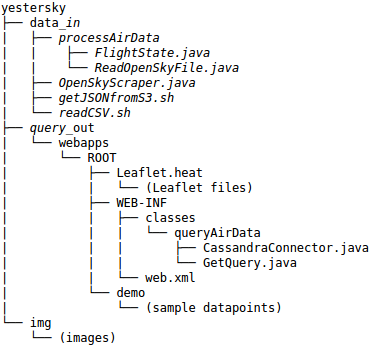

# YesterSky
A heatmap of historical air-traffic data.

1. [Overview](README.md#overview)
2. [Data](README.md#data)
3. [Pipeline](README.md#pipeline)
4. [Repository Structure](README.md#repository-structure)

## Overview

This project was completed as part of my Insight Data Engineering fellowship in Silicon Valley for Fall 2017. The project takes archived air-traffic data, along with live scrapes, and ingests it for use in a heatmap web application. While available, the application is at [yestersky.com](http://www.yestersky.com/).

The heat-map displays 1-hour intervals of data at one of four currently-supported resolution levels centered wherever you desire.

## Data

The data comes form the [OpenSky Network](https://opensky-network.org/). They are a community-based receiver network that collects air-traffic surveillance data. Every few seconds, an airplane sends a signal containing its GPS coordinates among other data. If one of the network's receivers picks it up, it is sent to OpenSky and stored indefinitely. In addition to the live data, they they make available batches of data from the last 10 Mondays; it has a size of about 5GB/day. They advertize much larger numbers for raw data and total storage, and they have data spanning from 2013.

For my project, I relied on the sample data, along with live scrapes, but I chose my technologies to be scalable and able to handle the full dataset, while still providing low-latency responses to queries.

## Pipeline 

To avoid overtrafficking OpenSky, I stored sample data and occasional live scrapes in S3. The data was pushed by Kafka, which provides scaling, ingestion, buffering, and processing capabilities that can be used to easily implement new features on the current product. The data is stored by Cassandra, a database with high scalability, availability, and fault tolerance. The web UI is provided by Tomcat and Leaflet, where queries can be made, and the results can be viewed on a map.

## Repository Structure

OpenSkyScraper provides some OpenSky data. Other data can be found at [https://opensky-network.org/datasets/states/](https://opensky-network.org/datasets/states/). Files are found and read by getJSONfromS3.sh or readCSV.sh, which both execute ReadOpenSkyFile.java in the package processAirData. This java file converts the data to messages and sends them to Kafka. Part of the conversion is AVRO serialization.

Confluent is a wrapper for Kafka that is used with Kafka-connect to connect Kafka to Cassandra. It also bundles Kafka Streams for quick deployment. Once the technologies are installed, configured, connected, and running, messages are sent to Cassandra. Queries on the data are made by the Web UI contained in query_out. The directory structure is exactly that which is needed for deployment in Tomcat7. In particular, the package queryAirData contains servlet GetQuery.java that does all of the heavy lifting in terms of connecting the frontend to Cassandra.

	
